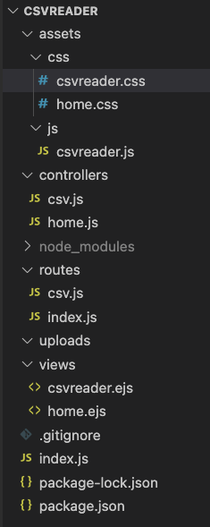

# CSV Reader
This is a CSV file reader project. Here we can upload a csv file and then open it to view, In view we can read the data in the csv file and even search for any word in the csv file 
We can also delete the csv file and upload a new csv file, we can upload multiple csv files 
***

### Demo:- https://csv-pp69.onrender.com/

## Project Structure 



## Install and Run on local system
```
$ git https://github.com/amitmungare/readCSV
$ npm i
```
## Run the project
```
$ npm start
```

## Run API's (localhost)

* Home page :-
``` http://localhost:8000/ ```
* Open csv file :-
``` http://localhost:8000/csv/open/?index=0 ```

you can also delete the csv file

